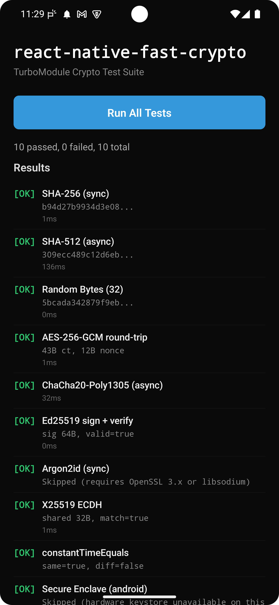
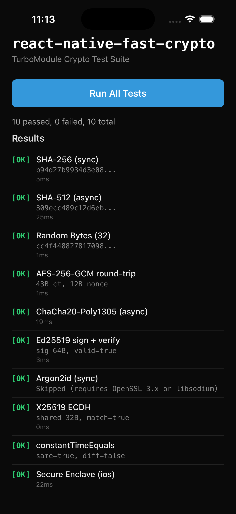

# @hikayat/react-native-fast-crypto

High-performance cryptographic primitives for React Native, powered by C++ TurboModules (JSI).

Built on OpenSSL (Android) and Apple CryptoKit / Security.framework (iOS) for native-speed crypto with a clean TypeScript API.

<p align="center">
  
  &nbsp;&nbsp;&nbsp;
  
</p>

## Why This Package?

Most React Native crypto libraries were written for the old bridge architecture and haven't kept up with the platform. Here's what makes `@hikayat/react-native-fast-crypto` different:

### vs. `react-native-crypto` / `crypto-browserify`

These are JavaScript polyfills that run crypto in the JS thread. They're slow (10-100x slower than native), block the UI, and don't have access to hardware security. This library runs everything in native C++/Swift through JSI -- no bridge serialization, no JS thread bottleneck.

### vs. `expo-crypto`

Expo's crypto module covers basic hashing and random bytes, but doesn't offer AEAD encryption (AES-GCM, ChaCha20-Poly1305), digital signatures (Ed25519), key exchange (X25519), key derivation (Argon2id), or hardware-backed Secure Enclave keys. This library provides a complete cryptographic toolkit.

### vs. `react-native-quick-crypto`

Quick Crypto is a solid Node.js `crypto` polyfill, but it mirrors the Node API rather than providing a focused, modern interface. This library is purpose-built for common real-world crypto tasks with a simpler API, both sync and async variants for every operation, and built-in Secure Enclave / TEE support that Quick Crypto doesn't offer.

### What's modern about it

| | Old bridge libraries | **@hikayat/react-native-fast-crypto** |
|---|---|---|
| **Architecture** | Bridge (JSON serialization) | TurboModule + JSI (direct C++ calls) |
| **Performance** | JS-thread crypto or async-only bridge calls | Native C++ with sync + async options |
| **Android 15** | Crash on 16KB page devices | Vendored static OpenSSL with 16KB alignment |
| **React Native** | 0.60-0.72, often broken on New Architecture | Built for 0.76+ New Architecture from day one |
| **Hardware keys** | Not supported | Secure Enclave (iOS) + Keystore/StrongBox (Android) |
| **API style** | Node.js polyfill or callback-based | Clean TypeScript, ArrayBuffer in/out |

### How It Works

```
  JavaScript                        Native
  ─────────                         ──────
  FastCrypto.hashSync(data, algo)
       │
       ▼
  TurboModule (JSI) ──────────────► C++ / Swift
  No bridge, no JSON,               Runs on calling thread (sync)
  direct function call               or thread pool (async)
       │                                    │
       │                            ┌───────┴───────┐
       │                            │               │
       │                          iOS            Android
       │                        CryptoKit      OpenSSL 1.1.1w
       │                        SecKey API     (static, 16KB safe)
       │                        Secure         Android Keystore
       │                        Enclave        / StrongBox
       │                            │               │
       ▼                            └───────┬───────┘
  ArrayBuffer ◄─────────────────────────────┘
  (zero-copy where possible)
```

1. **JavaScript** calls `FastCrypto.encryptSync(data, key, 'AES-256-GCM')` with `ArrayBuffer` arguments
2. The JS layer base64-encodes the buffers and calls the **TurboModule** via JSI -- a direct C++ function call, no bridge serialization
3. On **iOS**, the native layer uses Apple CryptoKit (AES-GCM, ChaCha20, Ed25519, X25519) and Security.framework (Secure Enclave)
4. On **Android**, a shared C++17 core (`fast_crypto_core.cpp`) calls OpenSSL via JNI. The Secure Enclave operations use Android Keystore (Java) with StrongBox fallback
5. Results are base64-encoded back to JS and decoded to `ArrayBuffer` -- giving you raw bytes you can use directly

**Sync operations** run on the calling thread (typically the JS thread) for sub-millisecond latency on small payloads. **Async operations** dispatch to a native thread pool so the JS thread stays free for UI work.

## Features

- **Hashing** -- SHA-256, SHA-512
- **AEAD Encryption** -- AES-256-GCM, ChaCha20-Poly1305
- **Digital Signatures** -- Ed25519 (RFC 8032)
- **Key Exchange** -- X25519 ECDH (RFC 7748)
- **Key Derivation** -- Argon2id (RFC 9106, requires OpenSSL 3.x or libsodium)
- **Secure Enclave / TEE** -- Hardware-backed key storage (iOS Secure Enclave, Android Keystore/StrongBox)
- **Utilities** -- CSPRNG, constant-time comparison
- **Sync + Async** -- Every operation has both sync and Promise-based variants
- **Android 16KB page support** -- Vendored static OpenSSL for Android 15+ compatibility

## Requirements

| Platform | Minimum Version |
| -------- | --------------- |
| React Native | 0.76+ (New Architecture) |
| iOS | 14.0+ |
| Android | API 23+ (compileSdk 36) |
| Android NDK | r27+ (for building from source) |

## Installation

```sh
npm install @hikayat/react-native-fast-crypto
# or
yarn add @hikayat/react-native-fast-crypto
```

### iOS

```sh
cd ios && pod install
```

### Android

No additional steps required. OpenSSL is vendored as a static library.

## Quick Start

```typescript
import { FastCrypto, toHex } from '@hikayat/react-native-fast-crypto';

// SHA-256 hash
const encoder = new TextEncoder();
const data = encoder.encode('hello world').buffer as ArrayBuffer;
const hash = FastCrypto.hashSync(data, 'SHA-256');
console.log(toHex(hash));
// b94d27b9934d3e08a52e52d7da7dabfac484efe37a5380ee9088f7ace2efcde9
```

## API Reference

All binary data is passed as `ArrayBuffer` and returned as `ArrayBuffer`.

### Hashing

```typescript
// Synchronous
const hash = FastCrypto.hashSync(data: ArrayBuffer, algorithm: 'SHA-256' | 'SHA-512'): ArrayBuffer;

// Asynchronous
const hash = await FastCrypto.hash(data: ArrayBuffer, algorithm: 'SHA-256' | 'SHA-512'): Promise<ArrayBuffer>;
```

### AEAD Encryption

Supports `'AES-256-GCM'` and `'ChaCha20-Poly1305'`.

```typescript
const key = FastCrypto.generateRandomBytesSync(32);
const plaintext = new TextEncoder().encode('secret message').buffer as ArrayBuffer;

// Encrypt
const { ciphertext, nonce, tag } = FastCrypto.encryptSync(plaintext, key, 'AES-256-GCM');

// Decrypt
const decrypted = FastCrypto.decryptSync(ciphertext, nonce, tag, key, 'AES-256-GCM');

// Async variants
const encrypted = await FastCrypto.encrypt(plaintext, key, 'ChaCha20-Poly1305');
const decrypted = await FastCrypto.decrypt(
  encrypted.ciphertext, encrypted.nonce, encrypted.tag, key, 'ChaCha20-Poly1305'
);
```

### Ed25519 Digital Signatures

```typescript
const { publicKey, privateKey } = FastCrypto.generateEd25519KeyPairSync();

const message = new TextEncoder().encode('sign this').buffer as ArrayBuffer;
const signature = FastCrypto.signSync(message, privateKey);
const valid = FastCrypto.verifySync(message, signature, publicKey); // true
```

### X25519 Key Exchange (ECDH)

```typescript
const alice = FastCrypto.generateX25519KeyPairSync();
const bob = FastCrypto.generateX25519KeyPairSync();

const sharedA = FastCrypto.xDiffieHellmanSync(alice.privateKey, bob.publicKey);
const sharedB = FastCrypto.xDiffieHellmanSync(bob.privateKey, alice.publicKey);
// sharedA === sharedB (32-byte shared secret)
```

### Argon2id Key Derivation

> Requires OpenSSL 3.x or libsodium. Falls back gracefully on platforms using OpenSSL 1.1.x.

```typescript
const password = new TextEncoder().encode('my password').buffer as ArrayBuffer;
const salt = FastCrypto.generateRandomBytesSync(16);
const derived = FastCrypto.argon2idSync(password, salt, 65536, 3, 32);
// or async
const derived = await FastCrypto.argon2id(password, salt, 65536, 3, 32);
```

### Secure Enclave / TEE

Hardware-backed key generation and encryption using iOS Secure Enclave or Android Keystore (StrongBox when available).

```typescript
const keyTag = 'com.myapp.encryption-key';

// Generate a hardware-backed key
await FastCrypto.generateSecureEnclaveKey(keyTag, false);
// Pass true for biometric-protected keys

// Encrypt / decrypt with hardware key
const plaintext = new TextEncoder().encode('sensitive data').buffer as ArrayBuffer;
const encrypted = await FastCrypto.encryptWithSecureEnclaveKey(keyTag, plaintext);
const decrypted = await FastCrypto.decryptWithSecureEnclaveKey(keyTag, encrypted);

// Clean up
await FastCrypto.deleteSecureEnclaveKey(keyTag);
```

### Random Bytes

```typescript
const bytes = FastCrypto.generateRandomBytesSync(32); // 32 random bytes
const bytes = await FastCrypto.generateRandomBytes(32); // async variant
```

### Constant-Time Comparison

```typescript
const equal = FastCrypto.constantTimeEquals(bufferA, bufferB); // boolean
```

### Encoding Utilities

```typescript
import { toHex, fromHex, toBase64, fromBase64, toUint8Array } from '@hikayat/react-native-fast-crypto';

toHex(buffer);           // ArrayBuffer -> hex string
fromHex('deadbeef');     // hex string -> ArrayBuffer
toBase64(buffer);        // ArrayBuffer -> base64 string
fromBase64('AAEC');      // base64 string -> ArrayBuffer
toUint8Array(buffer);    // ArrayBuffer -> Uint8Array
```

## Types

```typescript
import type {
  CipherResult,       // { ciphertext, nonce, tag } (all ArrayBuffer)
  KeyPair,            // { publicKey, privateKey } (all ArrayBuffer)
  HashAlgorithm,      // 'SHA-256' | 'SHA-512'
  AEADAlgorithm,      // 'AES-256-GCM' | 'ChaCha20-Poly1305'
  FastCryptoErrorCode, // Error code enum
  KeySecurityLevel,   // 'SOFTWARE' | 'KEYSTORE' | 'SECURE_ENCLAVE'
} from '@hikayat/react-native-fast-crypto';

import { FastCryptoError } from '@hikayat/react-native-fast-crypto';
```

## Architecture

```
TypeScript API (ArrayBuffer)
       |
  base64 encoding
       |
TurboModule bridge (JSI)
       |
  +---------+---------+
  |                   |
  iOS                Android
  CryptoKit          C++ / JNI
  Security.framework OpenSSL 1.1.1w (static)
  Secure Enclave     Android Keystore
```

- **iOS**: Apple CryptoKit for modern crypto, Security.framework for Secure Enclave
- **Android**: OpenSSL 1.1.1w compiled as a static library with 16KB page alignment, Android Keystore for hardware-backed keys
- **Shared**: C++17 core (`cpp/fast_crypto_core.cpp`) used on Android, separate native implementation on iOS

## Android 16KB Page Support

This library is compatible with Android 15+ devices using 16KB page sizes. OpenSSL is vendored as a static library built with `-Wl,-z,max-page-size=16384`, so all crypto code is embedded in `libfast_crypto.so` with proper alignment.

To rebuild the vendored OpenSSL from source:

```sh
scripts/build-openssl-android.sh
```

Requires Android NDK r27+ installed.

## Contributing

See [CONTRIBUTING.md](CONTRIBUTING.md) for development setup and guidelines.

## License

MIT - see [LICENSE](LICENSE) for details.

---

Created by [Syed Mohd Arif](https://github.com/syedmhdarif)
